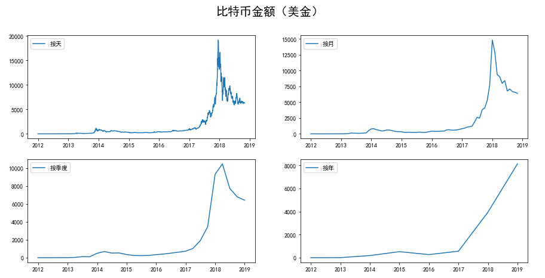
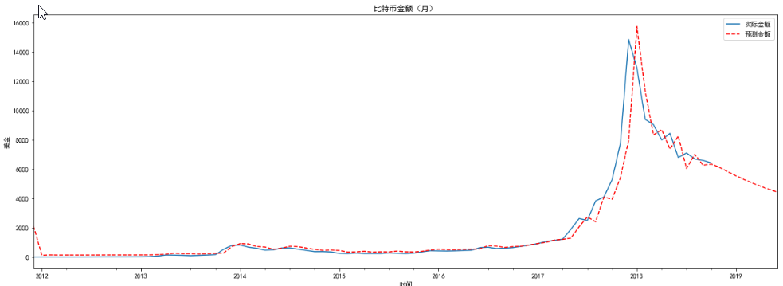

# 数据挖掘：如何对比特币走势进行预测

什么？不知道什么是比特币！？

> 比特币的概念是在2009年的时候，由一个名叫中本聪的人提出的，比特币是一种虚拟的数字货币，比特币和其它数字货币的最大不同就是比特币的数量是恒定的，比特币的总量被限制在2100万个，一个比特币就是一个特解，特解指方程组所能得到有限个解中的一组。
比特币的价格是会随着时间、交易场所的不同而发生波动的，比特币属于一种高风险投资，其价格跌涨也是没有限制的，可能一夜之间暴富，也可能一夜之间亏的血本无归，关于比特币值多少人民币的问题，大家可以通过各大交易平台来看出比特币实时价格，比特币的价格每时每刻都在波动，4月16日，BCEX公布的最新比特币价格为34471.11元人民币，Bibox公布的价格为33878.19人民币。
比特币从诞生到至今，其价格也是经历了多次跌涨，2009年比特币诞生初期，一美元可以买到1300枚比特币，在2010年的时候，比特币的价格在0.003美元左右一枚，直到2013年11月，比特币的价格经历了首次保障，当时一枚比特币的价格在8000元人民币左右，2017年比特币再次创造了奇迹，其价格在2017年12月的时候创造了历史最高价，一枚比特币的最高价值将近20000美元，换算成人民币，一枚比特币的价格将近13万人民币，也正是比特币的此次疯涨让无数人关注到了数字货币，在经历暴涨后，比特币的价格迅速暴跌了70%。

## 总结

1、通过一个比特币的趋势预测的实战项目可以体会到，当对一个数值进行预测时候，如果考虑到的是多个变量和结果之间的关系，可以采用回归分析，如果考虑单个时间维度与结果的关系，可以使用时间序列分析。

2、根据比特币的历史数据，可以使用ARMA模型对比特币的未来8个月的走势进行了预测，并对结果进行了可视化显示。于是能够看到ARMA工具还是很好用的，虽然比特币的走势受到很多外在的因素的影响，比如政策环境。不过当我们掌握这些历史数据，也不妨用时间序列模型来分析预测一下。

3、比特币走势预测
    - 时间序列预测
        - 概念：按照时间顺序组成的数字序列，时间序列预测是一种回归预测方法，通过数据预测未来的走势
        - 常用模型
            - AR(p):自回归模型，认为过去若干的时刻的点通过线性组合，再加上白噪声就可以预测到未来的某个时刻的点
            - MA(p,q):滑动平均模型，通过历史的白噪声进行了线性组合来影响当前时刻
                - generate(text):生成词云，传入的参数text代表你要分析的文本
            - ARMA(p,q):AR模型和MA模型的混合
            - ARIMA(p,d,q):差分自回归滑动平均模型，相比于ARMA，多了一个差分过程
    - ARMA工具
        - 引用：from statsmodels.tsa.arima_model import ARMA
        - 构造：ARMA(endog,order,exorg=None)
            - endog:代表内生变量。由模型决定的，不被政策左右的，可以说是我们想要解析的变量
            - order:代表的是p和q的值。也就是ARMA中的阶数
            - exog:代表的是外生变量，受外部因素的影响，不是我们模型想要研究的变量。
        - 功能函数
            - fit():拟合函数
            - predict(start, end):预测函数
                - start：预测的起始时间
                - end:预测的结束时间
        - AIC准则：也叫做赤池消息准则，是衡量统计模型好坏的一个标准，AIC数值越小代表的模型拟合的越好
    - 项目流程
        - 数据加载：
            - 准备阶段：数据探索，数据可视化，特征选择
            - 预测阶段：创建预测器，参数优化，结果可视化
            - 预测分析：未来8个的比特币会大幅度下跌价格将接近4000美金

预测结果：

基于上面的背景知识，由上图显示可以知道，按照天数来显示比特币的走势是最准确的，按月次之，下面的图是按月来预测走势，基本可以拟合实际走势，在2018年10月之后的8个月的时间里，比特币会触底到4000美金左右，实际上比特币在这个阶段确实是降低到4000元美金设置更低。在时间尺度的选择上，搜门选择了月，这样就对数据进行了降维，也节约了ARMA的模型训练时间。我们能够看到比特币金额（美元）这张图中，按月划分的比特币走势和按天划分的比特币走势差别不大，在减少了局部的波动的同时也能体现出比特币的趋势，这样就节约了ARMA的模型训练时间。
